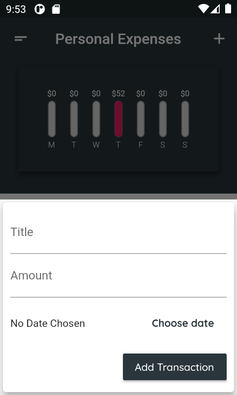

# Expenses_app

### This app is an personal Expense tracker that track daily expenses of a week.
### It displays how much you spent each day in a week in the form of chart.
 

- It's built using Flutter.
- It is responsive and adaptive. (Works on different device sizes and operating system)
- It is flexible i.e it provides different look on Android and iOS devices.

#### Screenshots of the app

##### Android Device (1080x2220) 
<pre>
        
     </pre>
 
 Landscape mode  
 <pre>
    
</pre>
  

##### Android Device(400x800)
<pre>
    
</pre>
